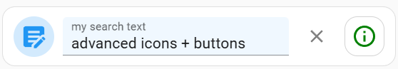

# Super Text Input Card for Home Assistant

I hate the default text_input card. It's huge, ugly and the onblur update is annoying. Especially on mobile. I wanted a replacement that was compact, flexible, could easily be styled and had icon(s)/button(s).

**So, I made one.** A highly customizable text input card that provides real-time updates, buttons (and actions), advanced styling options and more. It also supports firing events after text updates, to same on creating automations. It supports text entities as well as text_input entities. 




<br><br>
See [credits](#credits) below. This is my first attempt at a custom card. My first public repository. I'm sure there are bugs and missing features.

In particular, in real-time mode, every time there's an update (debounce based), the textfield loses focus. I'm using a hack to keep it focused - but you still get a momentary blink which is annoying. HELP!

## Features
- Real-time or on-blur text updates
- Configurable buttons with icons and actions
- Custom styling for card and text field
- Support for entity attributes (min/max length, pattern validation)
- Debounced updates to prevent excessive service calls

## Installation (not in HACS, yet...)
1. Download the files to your `config/www/community/super-text-input/` directory
2. Add resource in your dashboard configuration. There are two ways to do this:
    - **Using UI:** _Settings_ → _Dashboards_ → _More Options icon_ → _Resources_ → _Add Resource_ → Set _Url_ as `/local/super-text-input/super-text-input.js` → Set _Resource type_ as `JavaScript Module`.
      **Note:** If you do not see the Resources menu, you will need to enable _Advanced Mode_ in your _User Profile_
    - **Using YAML:** Add following code to `lovelace` section.
        ```yaml
        resources:
        - url: /local/community/super-text-input/super-text-input.js
          type: module
        ```
## Usage
We'll start with YAML usage. The card can also be (mostly) configured via the Dashboard UI Editor.

### Core Configuration

All the props are optional except type and entity.
```yaml
type: custom:super-text-input
entity: text.some_entity   # supports input_text and text entities
name: my name
label: enter text
placeholder: text here...
update_mode: realtime      # 'realtime' or 'blur' (blur is default)
debounce_time: 1000        # ms to wait before firing text update in realtime mode
```

example: <br>


### Card and TextEditor Styling 

The card and text editor can be styled using the `style` property.

```yaml
type: custom:super-text-input
entity: input_text.my_text

# Styling optional.
style:
  card:
    height: 56px
    padding: 8px
    background: white #card background
    border-radius: 28px
    border: 1px solid rgba(0,0,0,0.1)
  editor:
    height: 36px 
    background: rgba(0,0,0,0.03) #override editor area background.
    padding-left: 2px #push the location on the text and label
    margin-left: 18px #move the whole text field. be careful. if you have leading buttons this may mess things up.
    margin-right: 18px 
    margin-bottom: -4px #pull the text towards the base line. (def is -3px)
```
BubbleCard-esque:<br>


### Additional Text Change Action
I often want to do something when a textfield changes. Like execute a search or something. It's a pain to write automations all the time. So we have a prop `change_action` that takes a standard HA service call (like tap_action).
Note. It takes a templated string {{ value }}. So you can use the value of the text field in the service call.

```yaml
change_action:
  action: call-service
  service: script.mass_media_search
  data:
    search_param: "{{ value }}"
    media_type: playlist
    sensor_id: ma_mqtt_sensor
    media_player: MA Connect Basement
```

### Icons and Buttons
Buttons are optional. You can add as many as you want.
Most props are optional.

```yaml
buttons:
  - id: toast                   # id is useful for card_mod
    icon: mdi:text-box-edit   
    position: start             # where to place the button. start or end (in order)
    size: 38px                  # the size of the button
    icon_size: 26px             # the size of the icon
    style:                      # optional
      border_radius: 50%        # this is the default. you can override it.
    tap_action:                 # what do you want to do! omit for an icon. overrides..
                                # ..template (see below)
      action: fire-dom-event
      browser_mod:
        service: browser_mod.notification
        data:
          message: Your toast message here {{value}}
  - id: clear
    icon: mdi:close
    position: end               # where to place the button. start or end (in order)
    size: 36px
    icon_size: 20px
    style:
      color: grey               # override applied to icon
      background: transparent   # override applied to button
      margin_left: 4px          # fine-tuning position
      margin_right: "-4px"
      border-radius: 50%        # default
      border: none              # default
    template: clear             # IMPORTANT. We have a few built-in templated actions.
                                # clear: clears the text field
                                # toast: sends a toast
                                # more-info: opens more-info. if an entity prop is set 
                                # on the button, it will send a more-info on that entity.
```
Buttons:<br>


## Credits
The core card was inspired by [gadgetchnnel/lovelace-text-input-row](https://github.com/gadgetchnnel/lovelace-text-input-row/) and the config options were inspired by [delphiki../base-editor.js](https://github.com/delphiki/lovelace-pronote/blob/742076718f49f4557aee77ebd36bc0dbdd3ad281/src/editors/base-editor.js).